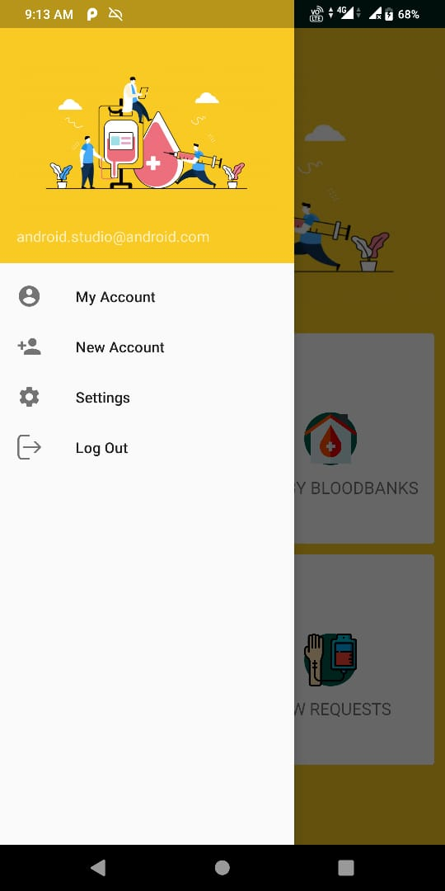
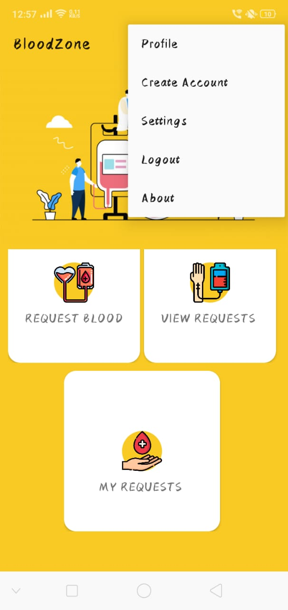
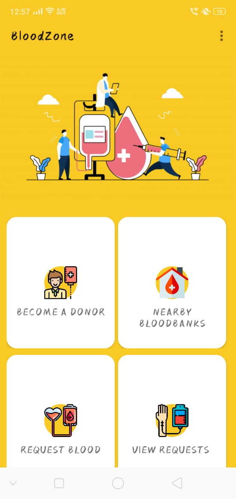

# BloodBank Online

  

An Android App to do the following:

- Show nearby bloodbanks.
- Allow people to register themselves for blood donation drives at their nearby bloodbanks online.
- Sort people by blood type.
- Allow people in need of a particular blood type to contact nearest bloodbank with that type available.
- Allow people in need of a particular blood type to contact registered donors directly in case of emergencies.
- Allow people who need blood but not so ugently to be put on waiting lists .
